# 每日签到💮

- 基于 [Github Actions](https://github.com/features/actions)
- 每天北京时间 **10点30分**（[UTC时间](https://datetime360.com/cn/utc-beijing-time/) 2点30分）进行自动签到
- 可用 [pushplus(推送加)](https://www.pushplus.plus/) 通过公众号推送结果

  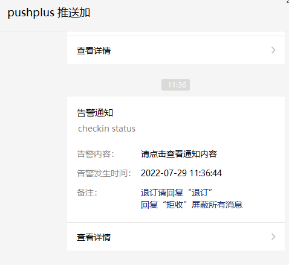

  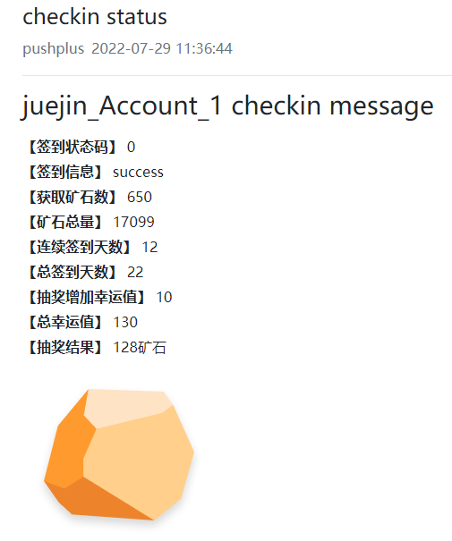

## 掘金签到

## 代码说明💻

## 使用说明💡

### 一、准备工作📝

- 账号的 cookie

  1. 打开 掘金网站 并登陆

  2. 相对应的开发者工具 **network** 标签下会任意找到一个请求，点击该请求，会出现更多信息，找到 "**Request Headers**" 里的 "**cookie**"，接下来设置密钥时需要用到

     

- pushplus的 token（不需要可以跳过）

  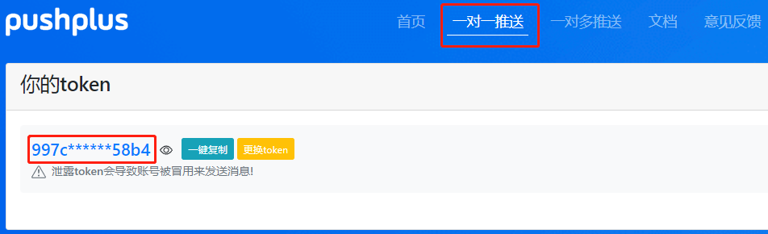

### 二、Fork此仓库🍴

点击仓库右上角的Fork

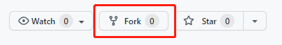

**注意：接下来的步骤都是在你自己fork后的仓库下进行操作.**

### 三、设置密钥🔑

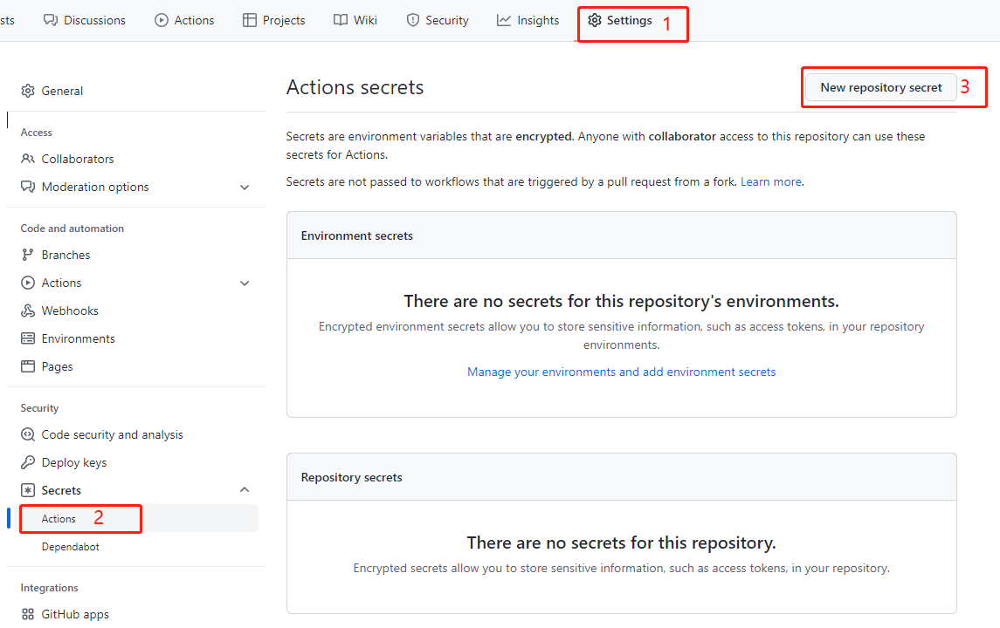

- JUEJIN_COOKIE：账号的 cookie（第一步准备工作中所找到的 cookie）
  - 单账号：直接填写

    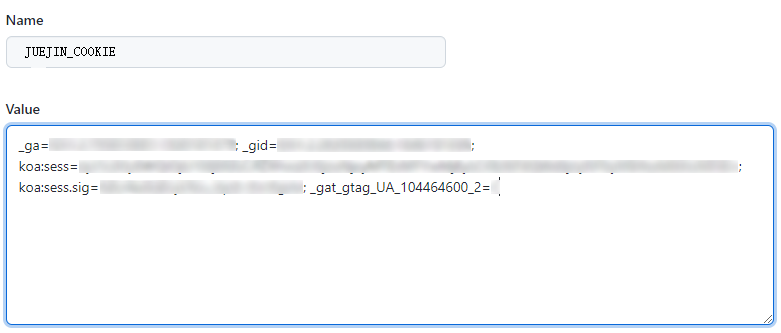

  - 多账号：每个 cookie 用 `&&` 隔开

    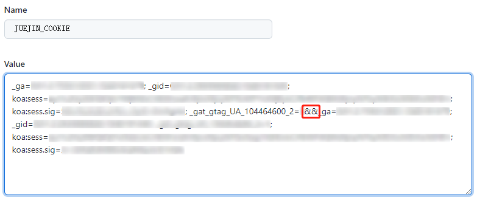

- PUSHPLUS_TOKEN：pushplus的 token（不需要推送功能，可以不创建）

  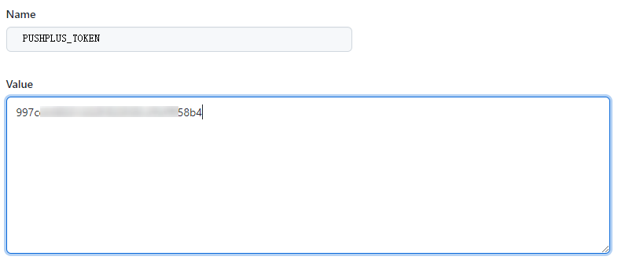

**注意：密钥名 JUEJIN_COOKIE 和 PUSHPLUS_TOKEN，两者的所有字母都是大写.**

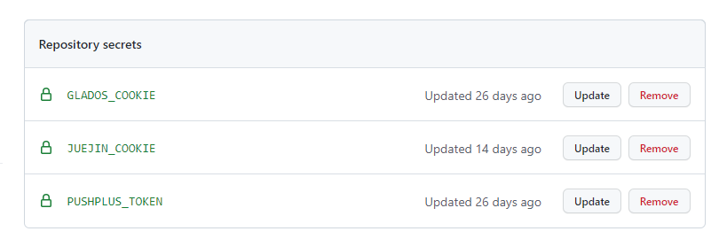

### 四、启用Action🖱

1. 点击 Actions，再点击 "I understand my workflows, go ahead and enable them"

   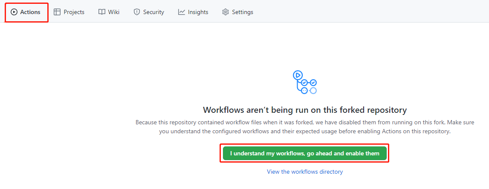

2. 点击仓库（你自己的）右上角的Star⭐

   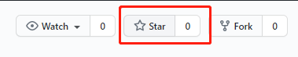

### 五、查看运行结果🔎

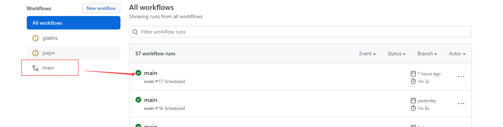

## 修改定时🕤

1. 打开 .github/workflows/checkin.yml

   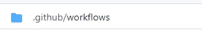

2. 修改 [crontab](https://zh.wikipedia.org/wiki/Cron) 表达式

   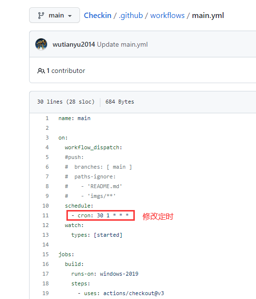

## 感谢

同步代码部分参考了[Auto_CheckIn](https://github.com/yaoysyao/Auto_CheckIn)、[GLaDOS-CheckIn](https://github.com/DullSword/GLaDOS-CheckIn)所写代码,特此感谢